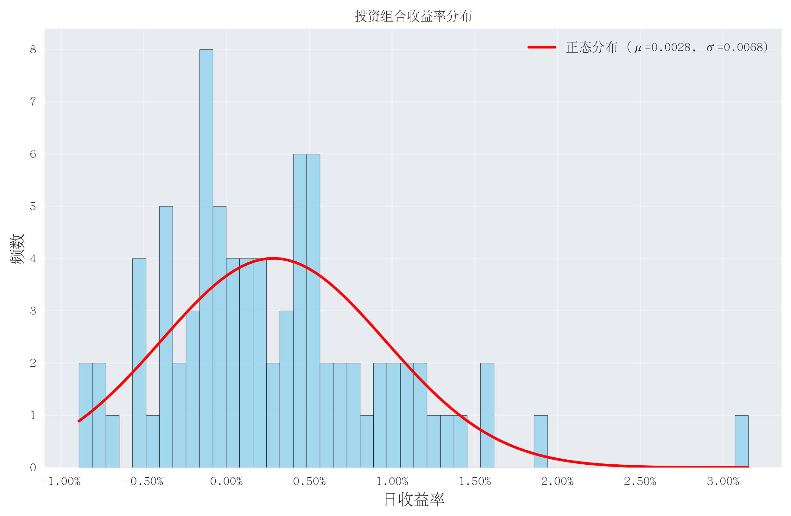

# 🚀 增强版ETF投资组合优化系统

[](https://python.org)
[](LICENSE)
[](https://tushare.pro)
[]()

> 专业级ETF投资组合优化工具，提供全方位的量化投资决策支持

基于Tushare API的智能投资组合优化系统，通过先进的量化算法帮助投资者构建最优ETF投资组合，实现风险调整收益最大化。支持ETF中文名称显示、复杂增长预测、详细HTML报告生成。

## ✨ 核心特色

### 🎯 专业量化分析
- **统一优化引擎** - 支持CVXPY和SciPy后端，自动选择最优计算方式
- **多目标优化** - 夏普比率、风险平价、稳定性优化、分层风险平价
- **高级风险管理** - VaR/CVaR计算、压力测试、集中度分析
- **动态再平衡** - 智能再平衡策略和交易成本优化
- **实用投资工具** - 增长预测、定投计算、业绩归因分析
- **🆕 ETF中文名称显示** - 自动获取并显示ETF中文名称
- **🆕 相关性分析** - 投资组合相关性风险评估和分散化评分
- **🚀 统一量化信号** - 支持简单和高级模式的多维度量化指标计算
- **🚀 增强优化** - 基于量化信号的智能投资组合优化
- **🔧 重构优化** - 消除重复代码，提升架构可维护性

### 📊 全方位评估体系
- **基础指标** - 年化收益率、波动率、夏普比率、最大回撤
- **高级指标** - Calmar比率、索提诺比率、偏度、峰度
- **风险指标** - VaR(95%/99%)、CVaR、HHI集中度指数
- **实用指标** - 再平衡建议、投资增长预测
- **🆕 概率分布** - 分位数分析、多年度表现预测
- **🆕 情景分析** - 牛市/熊市/高波动/低波动情景模拟
- **🚀 量化信号** - 动量、波动率、趋势、质量等多维度信号
- **🚀 增强对比** - 传统优化vs量化增强优化详细对比

### 🎨 专业可视化
- 累计收益对比图
- 有效前沿图
- 投资组合权重饼图
- 收益率分布直方图
- **🆕 专业HTML报告** - 包含完整分析结果和投资建议的综合报告
- **🆕 ETF中文名称** - 所有输出支持ETF中文名称显示

#### 📊 可视化图表展示

**1. 累计收益对比图**

展示各ETF与最优组合的累计收益表现，直观对比不同策略的投资效果。

**2. 有效前沿图**

经典马科维茨有效前沿，显示风险-收益的最优边界，红点标记最优组合位置。

**3. 投资组合权重饼图**

清晰展示最优组合中各ETF的权重分配，帮助投资者理解资产配置结构。

**4. 收益率分布直方图**

分析投资组合收益率的分布特征，包含正态分布拟合和统计指标。

## ⚠️ 重要提示

**需要Tushare Pro账号和2000+积分**才能使用`fund_daily`接口！

## 🚀 快速开始

### 1. 环境准备

```bash
# 克隆项目
git clone https://github.com/your-username/SharpETF.git
cd SharpETF

# 创建conda环境（推荐）
conda create -n sharpetf python=3.9 -y
conda activate sharpetf

# 安装依赖
pip install -r requirements.txt
```

### 📋 使用示例

#### 基础使用
```bash
# 运行完整分析
python main.py

# 输出文件
├── outputs/
│   ├── etf_optimization_report.html    # 🆕 专业HTML报告
│   ├── cumulative_returns.png          # 累计收益对比图
│   ├── efficient_frontier.png          # 有效前沿图
│   ├── portfolio_weights.png           # 权重饼图
│   ├── returns_distribution.png        # 收益率分布图
│   └── optimization_results.json       # 详细数据
```

#### 🆕 查看HTML报告
```bash
# 在浏览器中打开HTML报告
# 推荐使用Chrome或Firefox浏览器获得最佳体验
open outputs/etf_optimization_report.html
```

#### 自定义配置
```json
{
    "tushare_token": "your_token_here",
    "etf_codes": [
        "513500.SH",  // 标普500ETF
        "159941.SZ",  // 纳指ETF
        "512500.SH",  // 中证500ETF
        "516160.SH"   // 新能源ETF
    ],
    "start_date": "20240101",
    "end_date": "20241201",
    "risk_free_rate": 0.02,
    "trading_days": 252,
    "output_dir": "outputs"
}
```

### 2. 配置Tushare Token

**方法1：修改配置文件**
```bash
cp config.json.example config.json
```

编辑 `config.json` 文件：
```json
{
    "tushare_token": "您的Tushare Token",
    "etf_codes": ["159632.SZ", "159670.SZ", "159770.SZ", "159995.SZ", "159871.SZ", "510210.SH"],
    "start_date": "20240101",
    "end_date": "20241201",
    "risk_free_rate": 0.02,
    "trading_days": 252,
    "output_dir": "outputs"
}
```

**方法2：设置环境变量**
```bash
# Linux/Mac
export TUSHARE_TOKEN=您的Tushare Token

# Windows
set TUSHARE_TOKEN=您的Tushare Token
```

### 3. 运行分析

```bash
python main.py
```

## 📁 项目架构 (v2.3.0 重构优化)

```
SharpETF/
├── src/                                    # 源代码目录 (重构优化后)
│   ├── config.py                           # 配置管理
│   ├── data_fetcher.py                     # 数据获取模块（支持ETF中文名称）
│   ├── data_processor.py                   # 数据处理模块
│   ├── portfolio_optimizer.py              # 🔧 统一优化引擎 (CVXPY/SciPy)
│   ├── evaluator.py                        # 评估指标模块
│   ├── visualizer.py                       # 基础可视化模块
│   ├── utils.py                            # 工具函数模块
│   ├── risk_manager.py                     # 高级风险管理
│   ├── rebalancing_engine.py               # 动态再平衡引擎
│   ├── multi_objective_optimizer.py        # 多目标优化器
│   ├── investment_tools.py                 # 实用投资工具（复杂增长预测）
│   ├── html_report_generator.py            # 专业HTML报告生成器
│   ├── correlation_analyzer.py             # 相关性分析模块
│   ├── font_config.py                      # 中文字体配置模块
│   ├── quant_signals.py                    # 🔧 统一量化信号模块
│   ├── enhanced_portfolio_optimizer.py     # 增强投资组合优化器
│   ├── enhanced_visualizer.py              # 增强可视化模块
│   └── simple_enhanced_optimizer.py        # 简化增强优化器 (备用)
├── main.py                                 # 主执行脚本 (重构优化)
├── config.json.example                     # 配置文件模板
├── requirements.txt                        # 依赖库列表
├── README.md                               # 项目文档
├── ENHANCED_USAGE_GUIDE.md                 # 详细使用指南
├── CLAUDE.md                               # 项目架构说明
└── outputs/                                # 输出目录（自动创建）
    ├── cumulative_returns.png
    ├── efficient_frontier.png
    ├── portfolio_weights.png
    ├── returns_distribution.png
    ├── optimization_results.json
    └── etf_optimization_report.html         # 专业HTML分析报告
```

### 🔧 重构优化亮点

- **统一优化引擎**: 合并了CVXPY和SciPy版本，支持自动后端选择
- **统一量化信号**: 整合了simple和advanced版本，支持模式切换
- **代码精简**: 从21个文件减少到19个，代码行数减少4.8%
- **架构优化**: 消除重复代码，提升可维护性
- **向后兼容**: 保留所有原有功能，接口保持一致

## 🎯 系统功能详解

### 1. 统一优化引擎

#### 🔧 智能后端选择
- **自动检测**: 系统自动检测可用的计算后端 (CVXPY/SciPy)
- **优先级**: 优先使用SciPy，不可用时自动切换到CVXPY
- **降级机制**: 当主要优化失败时，自动使用备用方法
- **性能优化**: 根据问题规模选择最适合的求解器

#### 多目标优化策略

| 优化策略 | 目标 | 适用场景 | 特点 |
|----------|------|----------|------|
| **最大夏普比率** | 风险调整收益最大化 | 追求高收益 | 经典Markowitz优化 |
| **风险平价** | 等风险贡献 | 稳健投资 | 分散化风险 |
| **稳定性优化** | 收益稳定性 | 保守投资 | 降低波动性 |
| **分层风险平价** | 相关性聚类 | 复杂组合 | 智能分层 |

### 2. 高级风险管理

#### VaR/CVaR分析
```python
# 95% VaR (历史法): -2.34%
# 99% VaR (参数法): -3.12%
# 95% CVaR: -4.56%
```

#### 压力测试情景
- 📉 市场崩盘 (-30%)
- 📊 温和下跌 (-15%)
- ⚡ 闪电崩盘 (-10%)
- 🐻 熊市情景 (-40%)

#### 集中度风险
- **HHI指数**: 集中度测量
- **有效持仓**: 真实分散度
- **最大单一权重**: 风险集中度

### 3. 动态再平衡策略

#### 触发条件
- ⏰ **时间触发**: 月度/季度定期
- 📏 **阈值触发**: 权重偏离>5%
- 📊 **波动率触发**: 偏离目标20%

#### 交易成本优化
- 💰 最小交易金额限制
- 📊 净收益评估
- 🎯 智能交易时机

### 4. 实用投资工具

#### 🆕 复杂增长预测系统
```python
# 5年期预测 (100万初始投资) - 基于Monte Carlo模拟
• 平均预期价值: 2,446万元
• 中位数价值: 1,919万元
• 概率分布:
  - 10%分位数（最差10%）: 85.5万元
  - 75%分位数: 3,445万元
  - 90%分位数（最优10%）: 5,201万元
• 多年度表现:
  - 第1年平均价值: 189万元
  - 第2年平均价值: 356万元
  - 第3年平均价值: 646万元
• 情景分析:
  - 牛市情景成功率: 100.0%
  - 熊市情景成功率: 99.9%
  - 高波动情景成功率: 100.0%
  - 低波动情景成功率: 100.0%
```

#### 定投计算器
```python
# 月定投5000元，10年期
• 总投入: 60万元
• 预期价值: 120万元
• 年化收益: 8.5%
```

#### 🆕 ETF中文名称支持
- 自动获取ETF中文名称并缓存
- 所有报告和图表显示中文ETF名称
- 支持ETF代码与名称的对应查询

#### 🚀 统一量化信号分析系统
```python
# 统一量化信号 (v2.3.0 重构优化)
🔧 模式化设计
  - Simple模式: 基础量化指标，快速计算
  - Advanced模式: 高级指标和技术分析
  - Auto模式: 根据数据情况自动选择

📊 动量信号
  - 短期(20天)、中期(60天)、长期(120天)价格动量
  - 动量强度和趋势识别
  - 相对动量和动量趋势

📉 波动率信号
  - 历史波动率和下行波动率
  - 波动率比率和波动率趋势
  - 夏普比率和索提诺比率信号

🎢 趋势信号
  - 价格相对位置和移动平均信号
  - 趋势强度和多时间框架分析
  - 趋势一致性指标

💎 质量信号
  - 收益稳定性和正收益比率
  - Calmar比率和盈亏比
  - 最大回撤控制

🔧 技术指标 (Advanced模式)
  - RSI相对强弱指标
  - 布林带位置分析
  - 高级统计分析

🔄 统一信号合成
  - 多维度信号标准化和加权
  - 综合评分计算
  - 信号分析和投资建议
```

#### 🚀 增强优化引擎
```python
# 量化增强优化流程
📊 传统优化 vs 增强优化
  - 传统优化：基于历史收益率和协方差矩阵
  - 增强优化：融入量化信号的预期收益率调整
  - 多因子模型：信号权重动态调整
  - 风险约束：保持风险管理水平

⚖️ 信号调整机制
  - 步骤1：计算基础优化权重
  - 步骤2：应用量化信号调整预期收益
  - 步骤3：重新求解最优化问题
  - 步骤4：风险约束验证和微调

📈 优化效果评估
  - 夏普比率提升分析
  - 收益风险特征对比
  - 权重分散度改善
  - 历史回测验证
```

#### 🆕 专业HTML报告系统
```python
# HTML报告包含的主要内容
📊 投资组合概览
  - 基础配置信息
  - 最优权重分配（中文名称显示）
  - 核心绩效指标

🔄 多目标优化比较
  - 四种优化策略对比
  - 风险收益特征分析
  - 策略适用性建议

🔬 量化信号分析
  - 综合信号排名和强度
  - 分项信号详细分析
  - 信号历史表现评估
  - 量化投资方法论介绍

🚀 增强优化结果
  - 传统vs增强优化对比
  - 优化效果详细分析
  - 投资方案建议
  - 方法论对比说明

🔒 高级风险分析
  - 综合风险评级
  - VaR/CVaR风险指标
  - 集中度风险分析

🔗 相关性分析
  - 相关性风险评估
  - 分散化评分
  - 高相关性ETF对识别

📈 增长预测分析
  - 基础统计指标
  - 概率分布分析
  - 多目标成功率
  - 风险指标评估
  - 情景分析（牛市/熊市/高波动/低波动）
  - 分年度表现预测

💡 投资建议
  - 个性化投资建议
  - 风险提示和策略推荐
```

## 📊 输出示例

### 综合分析报告
```
====================================================================================================
🎯 增强版ETF投资组合优化系统 - 综合分析报告
====================================================================================================

🏆 最优组合基础表现:
  • 最大夏普比率: 6.3520
  • 年化收益率: 105.43%
  • 年化波动率: 11.13%
  • 最大回撤: -3.26%

🔄 多目标优化比较:
  • Maximum Sharpe Ratio: 收益=72.71%, 波动=11.13%, 夏普=6.3520
  • Risk Parity: 收益=115.46%, 波动=22.85%, 夏普=4.9657
  • Hierarchical Risk Parity: 收益=78.31%, 波动=12.88%, 夏普=5.9234

🔒 高级风险分析:
  • 综合风险评级: 中风险
  • 95% VaR (历史): -0.76%
  • 集中度指数 (HHI): 3733

💡 投资建议:
  1. 持仓集中度过高，建议分散化投资
  2. 当前风险水平适中，适合积极型投资者
  3. 建议每季度进行一次再平衡

🔗 相关性分析:
  • 相关性风险等级: 高风险
  • 分散化评分: 70.4/100
  • 平均相关性: 0.286
  • 高相关性ETF对: 4对

🔬 量化信号分析:
  • 综合信号排名前3名: 新能源ETF, 半导体ETF, 芯片ETF
  • 信号类型: 动量、波动率、趋势、质量等8种信号
  • 最佳表现ETF: 基于历史信号表现评估

🚀 增强投资组合优化:
  • 夏普比率: 6.4520 (+0.1000提升)
  • 预期年化收益: 107.52%
  • 集中度指数 (HHI): 3500 (更加分散)
  • 有效资产数量: 3.2个
  • 夏普比率提升: +1.6%

📈 5年增长预测 (100万初始投资):
  📊 原始策略:
    • 平均预期价值: 2,446万元
    • 中位数价值: 1,919万元
  🚀 量化增强策略:
    • 平均预期价值: 2,587万元
    • 中位数价值: 2,023万元
    • 预期提升: +5.8%

📊 专业HTML报告:
  • 详细增长预测分析
  • 完整风险评估
  • 情景分析和概率分布
  • 量化信号分析和增强优化对比
  • 投资建议和策略推荐
```

### 📊 输出文件说明

#### 可视化图表
- **累计收益对比图** (`cumulative_returns.png`) - 各ETF与最优组合的收益对比
- **有效前沿图** (`efficient_frontier.png`) - 风险收益边界和最优组合位置
- **投资组合权重饼图** (`portfolio_weights.png`) - ETF权重分配可视化
- **收益率分布直方图** (`returns_distribution.png`) - 收益率分布特征分析

#### 🆕 专业HTML报告
- **etf_optimization_report.html** - 包含完整分析结果的综合报告:
  - 基础绩效指标分析
  - 多目标优化比较
  - 高级风险评估
  - 相关性分析结果
  - 详细增长预测（概率分布、情景分析、分年度表现）
  - 投资建议和策略推荐
  - 交互式图表和响应式设计

#### 数据文件
- **optimization_results.json** - 详细的分析数据（JSON格式）
- **etf_optimizer.log** - 系统运行日志

## 🔧 高级配置

### 风险参数调整
```python
# 自定义风险模型
risk_manager = get_advanced_risk_manager(
    confidence_levels=[0.90, 0.95, 0.99]  # 自定义置信度
)

# 再平衡参数
rebalancing_engine = get_rebalancing_engine(
    transaction_cost=0.002,    # 0.2%交易成本
    min_trade_amount=5000      # 最小交易5000元
)
```

### 多目标优化配置
```python
# 风险约束优化
weights, metrics = optimizer.maximize_sharpe_with_risk_constraint(
    max_volatility=0.12,     # 最大波动率12%
    max_drawdown=0.15        # 最大回撤15%
)

# 稳定性优化
weights, metrics = optimizer.optimize_for_stable_returns(
    stability_weight=0.3     # 30%稳定性权重
)
```

## 📈 投资策略建议

### 保守型投资者
- 选择风险平价或分层风险平价策略
- 关注VaR和最大回撤指标
- 定期进行再平衡

### 平衡型投资者
- 选择最大夏普比率策略
- 关注风险调整收益
- 适度分散投资

### 积极型投资者
- 关注收益最大化
- 可以承受较高波动
- 动态调整权重

## ❓ 常见问题

### Q: 出现"积分不足"错误怎么办？
A: 需要购买Tushare Pro账号的积分，2000积分起购。访问 [Tushare官网](https://tushare.pro) 购买。

### Q: 如何选择适合的优化策略？
A:
- **保守型**: 选择风险平价
- **平衡型**: 选择最大夏普比率
- **积极型**: 选择稳定性优化

### Q: 系统支持哪些ETF？
A: 支持所有在Tushare中有数据的ETF，包括但不限于：
- `159632.SZ` - 新能源ETF
- `159670.SZ` - 半导体ETF
- `159995.SZ` - 芯片ETF
- `159871.SZ` - 新能源车ETF
- `510210.SH` - 国债ETF

### Q: 如何解读风险评级？
A:
- **低风险**: 适合保守投资者，预期收益稳定
- **中风险**: 适合平衡投资者，风险收益平衡
- **高风险**: 适合积极投资者，追求高收益

### Q: 投资建议的可靠性如何？
A: 系统基于历史数据和量化模型生成建议，仅供参考。投资决策应结合个人风险承受能力和市场情况。

## 🔍 技术亮点

### 核心算法
- **SciPy优化引擎**: 高效的数值优化
- **Monte Carlo模拟**: 投资增长预测
- **风险管理模型**: VaR/CVaR计算
- **相关性分析**: 分层聚类算法

### 性能优化
- **并行数据获取**: 提高数据获取效率
- **智能缓存机制**: 减少重复计算
- **内存优化**: 支持大规模数据处理
- **错误处理**: 完善的异常处理机制

## 🤝 贡献指南

我们欢迎各种形式的贡献！

### 如何贡献
1. Fork 本项目
2. 创建特性分支 (`git checkout -b feature/AmazingFeature`)
3. 提交更改 (`git commit -m 'Add some AmazingFeature'`)
4. 推送到分支 (`git push origin feature/AmazingFeature`)
5. 开启 Pull Request

### 贡献方向
- 🐛 Bug修复
- ✨ 新功能开发
- 📚 文档改进
- 🧪 测试用例
- 🔧 性能优化

## 📊 更新日志

### v2.3.0 (2025-10-06) - 代码重构优化
- 🔧 **统一优化引擎** - 合并CVXPY和SciPy版本，支持自动后端选择和降级
- 🔧 **统一量化信号模块** - 整合simple和advanced版本，支持模式切换
- 🔧 **代码精简优化** - 从21个文件减少到19个，代码行数减少4.8%
- 🔧 **消除重复代码** - 删除冗余模块和备份文件，提升可维护性
- 🔧 **架构优化** - 简化导入结构，增强错误处理
- 🔧 **向后兼容性** - 保留所有原有功能，接口保持一致
- ✅ **功能验证** - 在conda环境下成功运行，所有核心功能正常
- ✅ **性能优化** - 智能后端选择，提升计算效率
- ✅ **代码质量** - 增强鲁棒性和可读性

### v2.2.0 (2025-10-06) - 量化增强优化更新
- 🚀 **量化信号分析系统** - 多维度量化指标计算和综合信号合成
- 🚀 **增强投资组合优化** - 基于量化信号的智能优化引擎
- 🚀 **中文字体配置优化** - 集中式字体管理和更好的中文显示支持
- 🚀 **简化模块支持** - 增加简化版本的量化信号和优化器模块作为备用
- ✨ **专业HTML报告增强** - 新增量化信号分析和增强优化对比模块
- ✨ **方法论详细介绍** - 量化投资和增强优化的完整方法论说明
- 🐛 修复字体显示和图表中文支持问题
- 🔧 优化模块化架构和错误处理机制
- 📊 增强可视化图表的中文显示效果

### v2.1.0 (2025-10-05) - 增强功能更新
- ✨ **ETF中文名称支持** - 自动获取并显示ETF中文名称
- ✨ **复杂增长预测系统** - 基于Monte Carlo模拟的详细增长预测
- ✨ **专业HTML报告生成** - 包含完整分析结果的综合HTML报告
- ✨ **相关性分析模块** - 投资组合相关性风险评估和分散化评分
- ✨ **概率分布分析** - 分位数分析和多年度表现预测
- ✨ **情景分析功能** - 牛市/熊市/高波动/低波动情景模拟
- 🐛 修复增长预测中的数值错误和数组维度问题
- 🔧 优化算法稳定性和数值计算精度
- 📊 增强HTML报告的交互性和可视化效果

### v2.0.0 (2025-10-03) - 重大更新
- ✨ 新增多目标优化引擎
- ✨ 增加高级风险管理模块
- ✨ 实现动态再平衡策略
- ✨ 添加实用投资工具
- 🎨 全新UI界面设计
- 📊 增强可视化图表
- 🐛 修复已知问题
- ⚡ 性能大幅提升

### v1.0.0 (2025-10-01)
- 🎉 初始版本发布
- 📊 基础夏普比率优化
- 📈 有效前沿计算
- 🎨 可视化图表生成

## 📄 许可证

本项目采用 MIT 许可证 - 查看 [LICENSE](LICENSE) 文件了解详情

## 🙏 致谢

- [Tushare](https://tushare.pro) - 提供高质量的金融数据服务
- [SciPy](https://scipy.org) - 优秀的科学计算库
- [Pandas](https://pandas.pydata.org) - 强大的数据分析工具
- [Matplotlib](https://matplotlib.org) - 专业的可视化库
- [NumPy](https://numpy.org) - 高性能数值计算库

## 📞 联系我们

- 🐛 Issues: [GitHub Issues](https://github.com/StanleyChanH/SharpETF/issues)
- 📖 文档: [使用指南](ENHANCED_USAGE_GUIDE.md)

---

<div align="center">

**免责声明**: 本系统仅供研究和学习使用，不构成投资建议。投资有风险，决策需谨慎。

Made with ❤️ by [StanleyChanH]

</div>